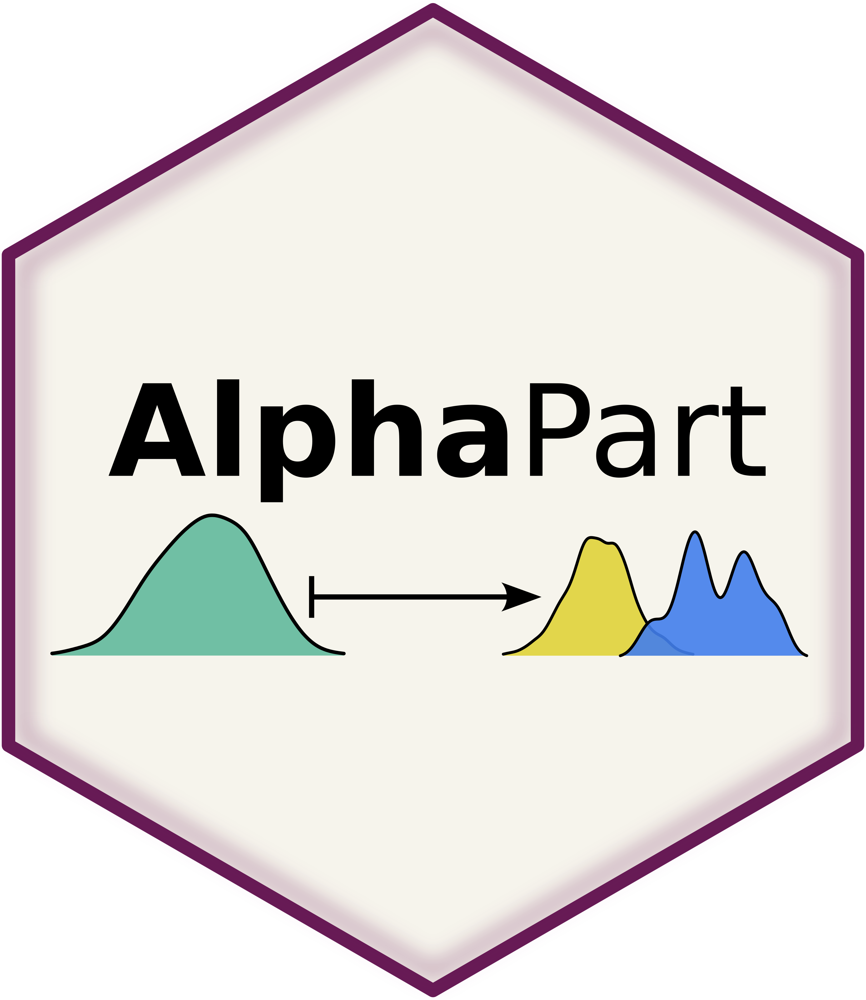
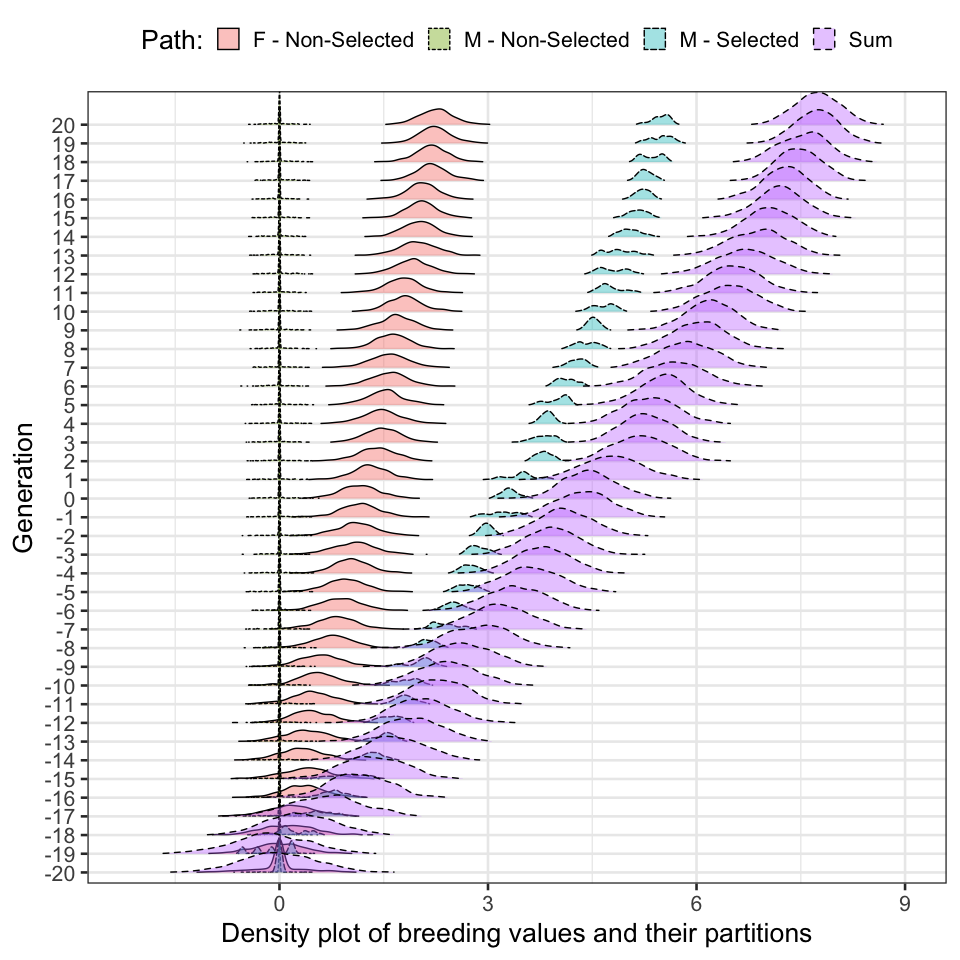
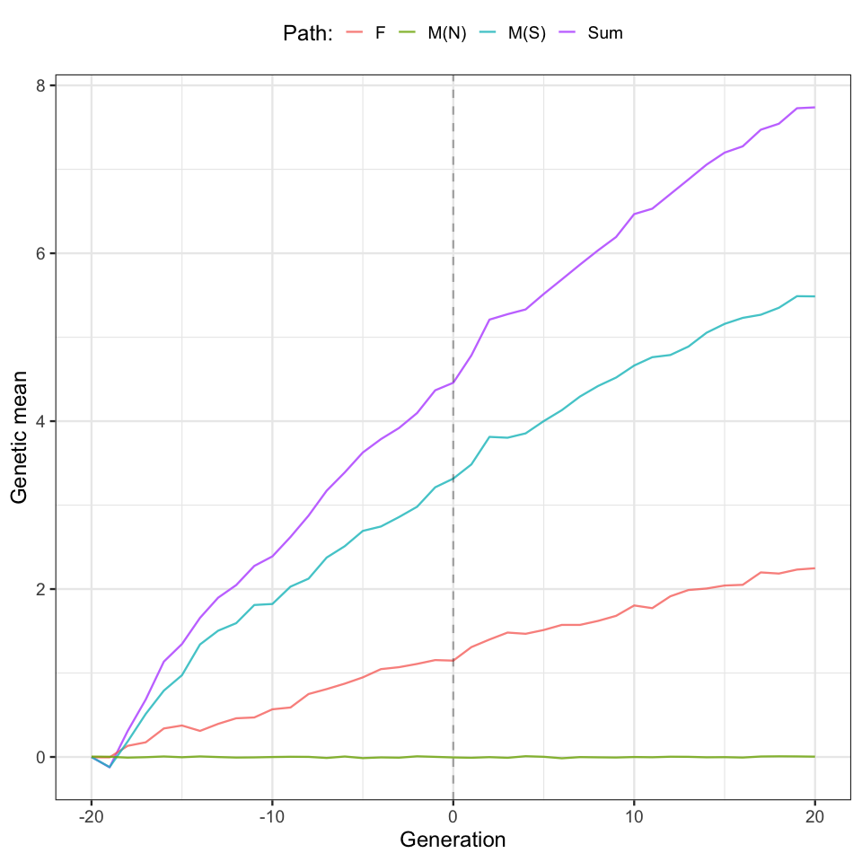
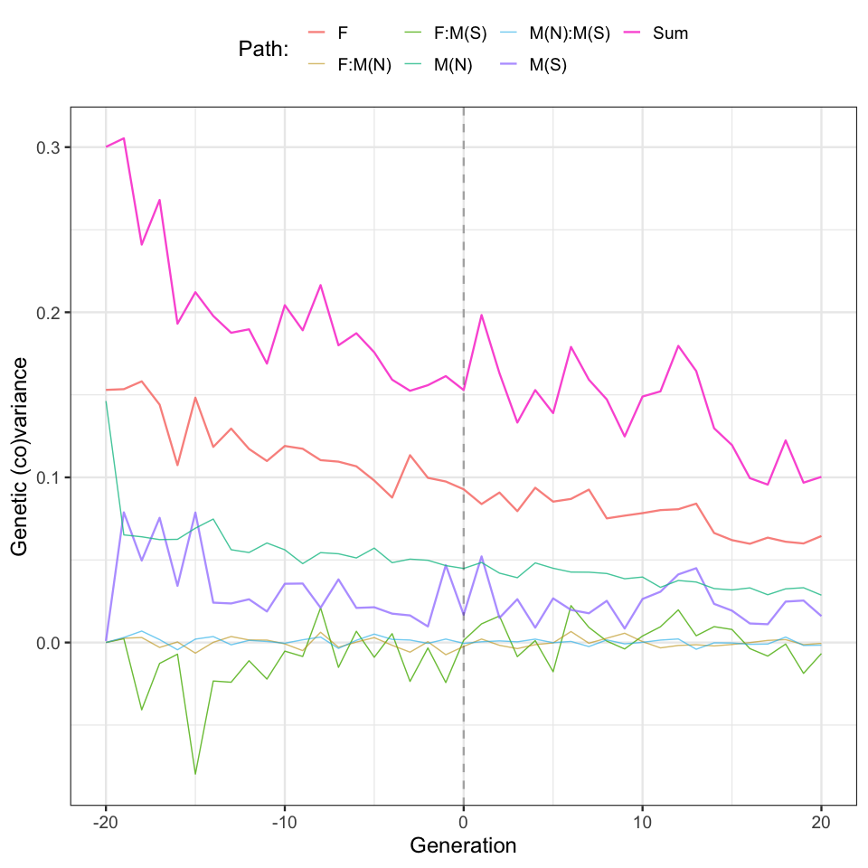

# AlphaPart 

| Package | Status | Coverage | GitHub | Miscellaneous |
|----|----|----|----|----|
| [](https://cran.r-project.org/package=AlphaPart) | [](https://img.shields.io/badge/development-active-blue.svg) | [](https://codecov.io/gh/AlphaGenes/AlphaPart) | [](https://github.com/AlphaGenes/AlphaPart/) | [](https://cranlogs.r-pkg.org/badges/AlphaPart) <!-- line break 1 --> |
| [](https://cran.r-project.org/web/checks/check_results_AlphaPart.html) | [](https://github.com/AlphaGenes/AlphaPart/actions/workflows/R-CMD-check.yaml) | [](https://github.com/AlphaGenes/AlphaPart/) | [](https://github.com/AlphaGenes/AlphaPart/) | [](https://cranlogs.r-pkg.org/badges/grand-total/AlphaPart) <!-- line break 2 --> |
| [](https://cran.r-project.org/) | [](https://ci.appveyor.com/project/Prof-ThiagoOliveira/alphapart) | **Code Factor** | [](https://github.com/AlphaGenes/AlphaPart/issues) | [](https://opensource.org/licenses/MIT) <!-- line break 3 --> |
| [](https://lifecycle.r-lib.org/articles/stages.html) |  | [](https://www.codefactor.io/repository/github/alphagenes/alphapart) | [](https://github.com/AlphaGenes/AlphaPart/) <!-- line break 4 --> |  |

# Overview

AlphaPart partitions genetic values and their summaries to quantify the
sources of genetic change in multi-generational pedigrees. The
partitioning method is described in \[Garcia-Cortes et al. (2008)\]
(<https://doi.org/10.1017/S175173110800205X>). This method enables a
retrospective genetic analysis of past changes in a population and is as
such a counterpart to prospective genetic methods describing genetic
change. The package includes the main function `AlphaPart` for
partitioning genetic values and auxiliary functions for manipulating
data and summarizing, visualizing, and saving results. Genetic values
can be breeding values, allele dosages, or similar quantities.

# Example

As an example, here are plots from the study of [Oliveira et
al. (2023)](https://doi.org/10.1186/s12711-023-00804-3). First, we show
distribution of breeding values and their partitions by selected males,
non-selected males, and all (=“non-selected”) females by generation.



The partitions were obtained by AlphaPart. As you can see, most of
genetic change is driven by selected males.

These distributions can be summarized by their means and (co)variances,
which are shown below. The plots demonstrate again that selected males
drive most of genetic change in the population - both in increased mean
and reduced variance.





# Instalation

`AlphaPart` is published on CRAN so you can simply install it using:

``` r
install.packages("AlphaPart")
```

To get recent bug fixes you can install the stable new version using:

``` r
# install.packages("devtools")
devtools::install_github("AlphaGenes/AlphaPart@main")
```

or the current development version using

``` r
# install.packages("devtools")
devtools::install_github("AlphaGenes/AlphaPart@devel")
```

# Usage

``` r
library(AlphaPart)
data(AlphaPart.ped)

# Partitioning
res <- AlphaPart(x = AlphaPart.ped, colPath = "country", colBV = "trait1")
print(res)
#  Partitions of breeding values 
#    - individuals: 8 
#    - paths: 2 (domestic, import)
#    - traits: 1 (trait1)
# 
#  Trait: trait1 
# 
#   id father mother generation  country sex trait2 trait1 trait1_pa trait1_ms trait1_domestic trait1_import
# 1  A                        1 domestic   F     88    100       0.0     100.0         100.000         0.000
# 2  B                        1   import   M    110    105       0.0     105.0           0.000       105.000
# 3  C      B      A          2 domestic   F    100    104     102.5       1.5          51.500        52.500
# 4  T      B                 2   import   F     97    102      52.5      49.5           0.000       102.000
# 5  D                        2   import   M    101    108       0.0     108.0           0.000       108.000
# 6  E      D      C          3 domestic   M     80    107     106.0       1.0          26.750        80.250
# 7  U      D                 3   import   F    102    107      54.0      53.0           0.000       107.000
# 8  V      E                 4 domestic   F    105    109      53.5      55.5          68.875        40.125

# Summarising (results ommited for brevity, see vignettes for more introduction)
sumPartByGeneration <- summary(part, by = "generation")
print(sumPartByGeneration)

# Plotting (results ommited for brevity, see vignettes for more introduction)
plot(sumPartByGeneration)
```

# Vignettes

- Introduction to AlphaPart - see [intro](vignettes/intro.Rmd) or
  `vignette("intro", package = "AlphaPart")`

- AlphaPart: Partitioning genetic values and summarising their trend
  with mean and variance - see [variance](vignettes/variance.Rmd) or
  `vignette("variance", package = "AlphaPart")`

- AlphaPart: Accounting for non-zero mean and structure in founders -
  see [founders](vignettes/founders.Rmd) or
  `vignette("founders", package = "AlphaPart")`

- AlphaPart: Accounting for uncertainty of estimated genetic values in
  partitioning - see [samples](vignettes/samples.Rmd) or
  `vignette("samples", package = "AlphaPart")`

- AlphaPart: Partitioning genotypes - see
  [genotypes](vignettes/genotypes.Rmd) or
  `vignette("genotypes", package = "AlphaPart")`

- AlphaPart: Partitioning with idenity-by-descent (IBD) information -
  see [ibd](vignettes/ibd.Rmd) or
  `vignette("ibd", package = "AlphaPart")`

- References on the theoretical and applied work in this domain are
  briefly summarised in [References](vignettes/references.Rmd).
  
<!-- badges: start -->
[](https://github.com/AlphaGenes/AlphaPart/actions/workflows/R-CMD-check.yaml)
<!-- badges: end -->
