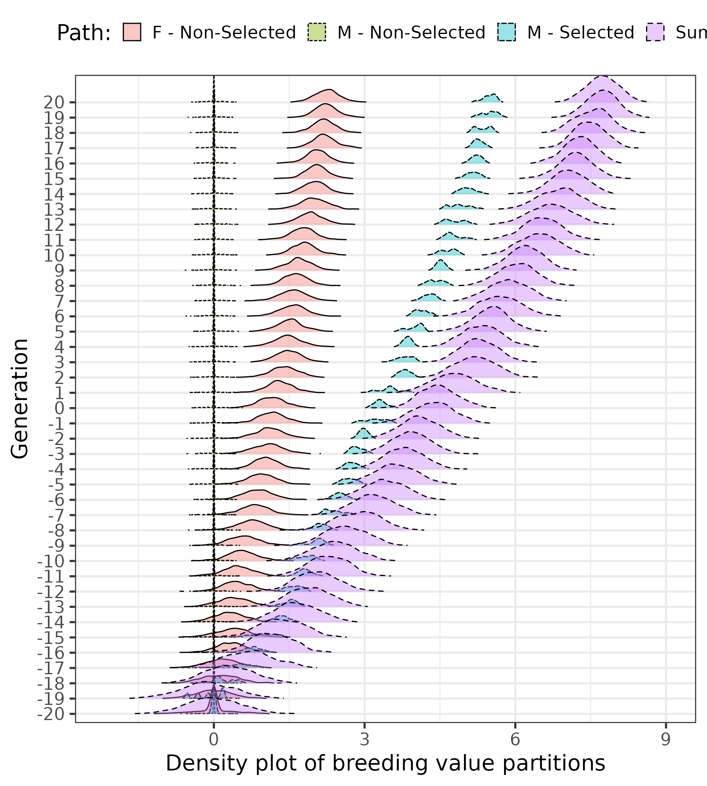
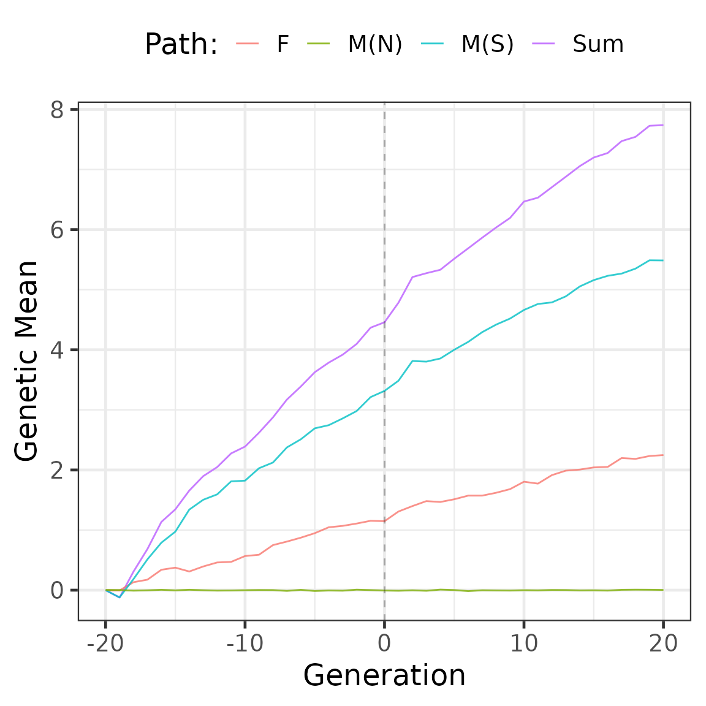

# Partitioning genetic trends in mean and variance

In breeding programmes, the observed genetic change is a sum of the
contributions of different groups of individuals. Here we show how to
partition the genetic mean and variance of breeding values using
AlphaPart.

In addition to the contribution of paths to changes in genetic mean,
breeding programmes should also consider analysing changes in genetic
variance to understand the drivers of genetic change in a population
fully. Managing the change in genetic mean and variance in breeding
programmes is essential to ensure long-term genetic gain.

## Loading packages

``` r
#=======================================================================
# Packges
#=======================================================================
#devtools::install_github("AlphaGenes/AlphaPart")
library(AlphaPart)
library(dplyr)
library(ggplot2)
library(ggridges)
```

## Loading datafile

``` r
#=======================================================================
# Reading and organizing Scenario 1
#=======================================================================
data <-  readRDS("./../inst/extdata/AlphaPartCattleSim.rds") %>%
  dplyr::mutate(across(generation:mother, as.numeric)) %>%
  dplyr::rename(status = type) %>%
  dplyr::mutate(across(c("sex", "status"), as.factor)) %>%
  dplyr::mutate(path = interaction(sex,status, sep = ":")) %>%
  arrange(generation, ind) %>%
  select(ind, father, mother, sex, status, path, generation, tbv, pheno) %>%
  dplyr::mutate(generation = generation - 20) %>%
  droplevels()

# Data head
head(data) %>%
  knitr::kable(digits = 2)
```

| ind | father | mother | sex | status       | path           | generation |   tbv | pheno |
|----:|-------:|-------:|:----|:-------------|:---------------|-----------:|------:|------:|
|   1 |      0 |      0 | M   | Non-Selected | M:Non-Selected |        -20 | -0.27 | -0.48 |
|   2 |      0 |      0 | F   | Non-Selected | F:Non-Selected |        -20 |  0.75 |  0.89 |
|   3 |      0 |      0 | M   | Non-Selected | M:Non-Selected |        -20 | -0.10 | -0.04 |
|   4 |      0 |      0 | F   | Non-Selected | F:Non-Selected |        -20 | -0.53 | -1.44 |
|   5 |      0 |      0 | M   | Non-Selected | M:Non-Selected |        -20 |  0.70 |  0.88 |
|   6 |      0 |      0 | F   | Non-Selected | F:Non-Selected |        -20 |  0.25 | -0.63 |

``` r
# Data size
dim(data)
```

    ## [1] 42000     9

- `ind` - individual
- `father` and `mother` - individual’s parents
- `sex` - individual sex
- `status` - if the individual is or not selected
- `path` - the path variable used to partition the additive genetic mean
- `tbv` - true breeding value
- `pheno` - phenotypic value

## Partitioning trends in genetic mean and variance

We use the `AlphaPart` function to partition the true breeding values
`(tbv)` in the `data` by the animal sex and status variable combination
into females (F) and males (M) non-selected (N) and males selected (S)
contributions:

``` r
part <- AlphaPart(data, colId = "ind", colFid = "father", 
                  colMid = "mother", colBV = "tbv", colPath = "path")
```

    ## 
    ## Size:
    ##  - individuals: 42000 
    ##  - traits: 1 (tbv)
    ##  - paths: 3 (F:Non-Selected, M:Non-Selected, M:Selected)
    ##  - unknown (missing) values:
    ## tbv 
    ##   0

``` r
head(part$tbv) %>%
  knitr::kable(digits = 2)
```

| ind | father | mother | sex | status       | path           | generation | pheno |   tbv | tbv_pa | tbv_w | tbv_F:Non-Selected | tbv_M:Non-Selected | tbv_M:Selected |
|----:|-------:|-------:|:----|:-------------|:---------------|-----------:|------:|------:|-------:|------:|-------------------:|-------------------:|---------------:|
|   1 |      0 |      0 | M   | Non-Selected | M:Non-Selected |        -20 | -0.48 | -0.27 |      0 | -0.27 |               0.00 |              -0.27 |              0 |
|   2 |      0 |      0 | F   | Non-Selected | F:Non-Selected |        -20 |  0.89 |  0.75 |      0 |  0.75 |               0.75 |               0.00 |              0 |
|   3 |      0 |      0 | M   | Non-Selected | M:Non-Selected |        -20 | -0.04 | -0.10 |      0 | -0.10 |               0.00 |              -0.10 |              0 |
|   4 |      0 |      0 | F   | Non-Selected | F:Non-Selected |        -20 | -1.44 | -0.53 |      0 | -0.53 |              -0.53 |               0.00 |              0 |
|   5 |      0 |      0 | M   | Non-Selected | M:Non-Selected |        -20 |  0.88 |  0.70 |      0 |  0.70 |               0.00 |               0.70 |              0 |
|   6 |      0 |      0 | F   | Non-Selected | F:Non-Selected |        -20 | -0.63 |  0.25 |      0 |  0.25 |               0.25 |               0.00 |              0 |

We use the generic `summary.AlphaPart` function to summarize an
`AlphaPart` object by generation, con\*sering:

- the function **mean**

``` r
# Trends in the additve genetic mean
partMean <- summary(part, by = "generation", FUN = mean)

head(partMean$tbv) %>%
  knitr::kable(digits = 2)
```

| generation |    N |   Sum | F:Non-Selected | M:Non-Selected | M:Selected |
|-----------:|-----:|------:|---------------:|---------------:|-----------:|
|        -20 | 2000 |  0.00 |           0.00 |           0.00 |       0.00 |
|        -19 | 1000 | -0.12 |           0.00 |           0.00 |      -0.12 |
|        -18 | 1000 |  0.31 |           0.13 |          -0.01 |       0.18 |
|        -17 | 1000 |  0.68 |           0.17 |           0.00 |       0.51 |
|        -16 | 1000 |  1.14 |           0.34 |           0.01 |       0.79 |
|        -15 | 1000 |  1.34 |           0.37 |           0.00 |       0.97 |

- the function **variance**

``` r
# Trends in the additive genetic variance
partVar <- summary(part, by = "generation", FUN = var, cov = TRUE)

head(partVar$tbv) %>%
  knitr::kable(digits = 2)
```

| generation |    N |  Sum | F:Non-Selected | M:Non-Selected | M:Selected | F:Non-SelectedM:Non-Selected | F:Non-SelectedM:Selected | M:Non-SelectedM:Selected |
|-----------:|-----:|-----:|---------------:|---------------:|-----------:|-----------------------------:|-------------------------:|-------------------------:|
|        -20 | 2000 | 0.30 |           0.15 |           0.15 |       0.00 |                         0.00 |                     0.00 |                     0.00 |
|        -19 | 1000 | 0.31 |           0.15 |           0.07 |       0.08 |                         0.00 |                     0.00 |                     0.00 |
|        -18 | 1000 | 0.24 |           0.16 |           0.06 |       0.05 |                         0.00 |                    -0.04 |                     0.01 |
|        -17 | 1000 | 0.27 |           0.14 |           0.06 |       0.08 |                         0.00 |                    -0.01 |                     0.00 |
|        -16 | 1000 | 0.19 |           0.11 |           0.06 |       0.03 |                         0.00 |                    -0.01 |                     0.00 |
|        -15 | 1000 | 0.21 |           0.15 |           0.07 |       0.08 |                        -0.01 |                    -0.08 |                     0.00 |

### Example of plots to analyse the results

Distribution of breeding value partitions by sex and selection status
(selected males (M(S)), non-selected males (M(N)), and females (F)) over
generations.

``` r
part$tbv %>%
  ggplot(aes(y = as.factor(generation), `tbv_F:Non-Selected`)) +
  geom_density_ridges(
    aes(fill = "F - Non-Selected", linetype = "F - Non-Selected"),
    alpha = .4, point_alpha = 1, rel_min_height = 0.01
  ) +
  geom_density_ridges(
    aes(y = as.factor(generation), x= `tbv_M:Non-Selected`, fill = "M - Non-Selected",
        linetype = "M - Non-Selected"),
    alpha = .4, point_alpha = 1, rel_min_height = 0.01
  ) +
  geom_density_ridges(
    aes(y = as.factor(generation), x= `tbv_M:Selected`, fill = "M - Selected",
        linetype = "M - Selected"),
    alpha = .4, point_alpha = 1, rel_min_height = 0.01
  ) +
  geom_density_ridges(
    aes(y = as.factor(generation), x= `tbv`,
        fill = "Sum", linetype = "Sum"),
    alpha = .4, point_alpha = 1, rel_min_height = 0.01
  ) +
  ylab("Generation") +
  xlab("Density plot of breeding value partitions") +
  labs(fill = "Path:", linetype = "Path:") +
  theme_bw(base_size = 20) +
  theme(
    legend.position = "top"
  ) 
```

    ## Picking joint bandwidth of 0.0624

    ## Picking joint bandwidth of 0.0073

    ## Picking joint bandwidth of 0.0357

    ## Picking joint bandwidth of 0.0918



Partitions of genetic mean and variance by sex and selection status
(selected males (M(S)), non-selected males (M(N)), and females (F))
using true breeding values:

``` r
partMean$tbv %>%
  ggplot(aes(y = Sum, x = generation, colour = "Sum"),
         size = 0.1) +
  scale_linetype_manual(
    values = c("solid", "longdash", "dashed", "dotted"))+
  geom_line() +
  geom_line(aes(y = `F:Non-Selected`, x = generation, 
                colour = "F"), alpha = 0.8) +
  geom_line(aes(y = `M:Selected`, x = generation,
                colour = "M(S)"), alpha = 0.8) +
  geom_line(aes(y = `M:Non-Selected`, x = generation,
                colour = "M(N)"), alpha = 0.8) +
  geom_vline(xintercept = 0, linetype = 2, alpha = 0.3) +
  ylab("Genetic Mean") +
  xlab("Generation") +
  labs(colour = "Path:") +
  theme_bw(base_size = 18) + 
  theme(legend.position = "top")
```

    ## Warning in fortify(data, ...): Arguments in `...` must be used.
    ## ✖ Problematic argument:
    ## • size = 0.1
    ## ℹ Did you misspell an argument name?



``` r
partVar$tbv %>%
  ggplot(aes(y = Sum, x = generation, colour = "Sum")) +
  geom_line() +
  geom_line(aes(y = `F:Non-Selected`, x = generation,
            colour = "F"), alpha = 0.8) +
  geom_line(aes(y = `F:Non-SelectedM:Selected`, x = generation,
            colour = "F:M(S)"), size =0.5, alpha =0.8) +
  geom_line(aes(y = `F:Non-SelectedM:Non-Selected`, x = generation,
            colour = "F:M(N)"), size =0.5, alpha =0.6) +
  geom_line(aes(y = `M:Non-SelectedM:Selected`, x = generation,
            colour = "M(N):M(S)"), size =0.5, alpha =0.6) +
  geom_line(aes(y = `M:Selected`, x = generation,
            colour = "M(S)"), alpha = 0.8) +
  geom_line(aes(y = `M:Non-Selected`, x = generation,
            colour = "M(N)"), size =0.5, alpha =0.8) +
  geom_vline(xintercept = 0, linetype = 2, alpha = 0.3) +
  ylab("Genetic Variance") +
  xlab("Generation") +
  labs(colour = "Path: ") +
  theme_bw(base_size = 18) +
  theme(
    legend.position = "top"
  )
```

    ## Warning: Using `size` aesthetic for lines was deprecated in ggplot2 3.4.0.
    ## ℹ Please use `linewidth` instead.
    ## This warning is displayed once every 8 hours.
    ## Call `lifecycle::last_lifecycle_warnings()` to see where this warning was
    ## generated.


